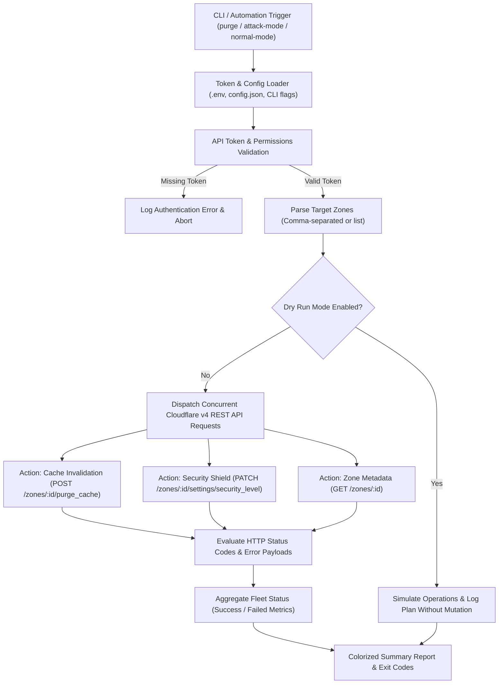

# ☁️ cf-zone-ops

[](LICENSE)
[](https://cloudflare.com)
[](https://github.com/MobileConduit/cf-zone-ops/actions)
[](https://nodejs.org)

High-productivity CLI utility and fleet management tool tailored for infrastructure administrators managing portfolios of hundreds of domains. Execute bulk cache invalidation, instant DDoS "Under Attack" shielding, and batch security updates across entire zone fleets.

---

## 📐 Fleet Architecture & Operation Flow



---

## ⚡ Key Features

- **Bulk Cache Invalidation**: Clear entire edge caches across hundreds of zones simultaneously.
- **Instant DDoS Mitigation**: Toggle "Under Attack" mode or adjust security levels (`off`, `essentially_off`, `low`, `medium`, `high`, `under_attack`) instantly across all zones.
- **Dry-Run Safety Engine**: Preview planned operations and audit actions without mutating production infrastructure.
- **Zero Heavy Dependencies**: Built with native Node.js HTTP/HTTPS modules for ultra-fast startup and portability.
- **Robust Error Diagnostics**: Real-time error handling with HTTP status inspection, rate limit handling, and API message decoding.
- **Colorized Terminal Output**: Enhanced visual logging with ANSI colors and cross-platform fallbacks.

---

## 🚀 Quick Start

### 1. Installation
```bash
git clone https://github.com/MobileConduit/cf-zone-ops.git
cd cf-zone-ops
npm link  # Optional: exposes global 'cf-ops' CLI binary
```

### 2. Configuration
Copy the configuration template:
```bash
cp .env.example .env
# or edit config.json
```

**Configuration via `.env`:**
```env
CF_API_TOKEN=your_cloudflare_api_token_here
CF_API_HOST=api.cloudflare.com
DEFAULT_SECURITY_LEVEL=medium
REQUEST_TIMEOUT_MS=30000
DRY_RUN=false
```

### 3. Usage Examples

**Bulk Cache Purge:**
```bash
node index.js purge zoneId1,zoneId2,zoneId3
# Using binary if linked:
cf-ops purge zoneId1,zoneId2,zoneId3
```

**Emergency DDoS "Under Attack" Shielding:**
```bash
node index.js attack-mode zoneId1,zoneId2
```

**Revert to Normal Security Mode:**
```bash
node index.js normal-mode zoneId1,zoneId2
```

**Set Custom Security Level:**
```bash
node index.js set-security high zoneId1,zoneId2
```

**Dry-Run Audit (Preview without executing mutations):**
```bash
node index.js purge zoneId1,zoneId2 --dry-run
```

---

## ⚙️ Operational Flags & Options

| Command / Option | Description |
|---|---|
| `purge <zones>` | Invalidate all cached assets across specified zone IDs |
| `attack-mode <zones>` | Elevate security level to `under_attack` (I'm Under Attack Mode) |
| `normal-mode <zones>` | Restore security level to `medium` (standard operating state) |
| `set-security <level> <zones>` | Set explicit level (`off`, `essentially_off`, `low`, `medium`, `high`, `under_attack`) |
| `zone-info <zones>` | Fetch and display live zone metadata and verification status |
| `--token <token>` | Explicit Cloudflare API token (overrides env and config file) |
| `--dry-run` | Simulate actions without executing API mutations |
| `--config <file>` | Path to JSON configuration file (default: `config.json`) |
| `--env <file>` | Path to environment variables file (default: `.env`) |
| `--no-color` | Disable ANSI color codes in console output |
| `-h, --help` | Display CLI usage manual |

---

## 🧪 Automated Testing

The project includes an automated test suite executed with Node's native test runner:

```bash
npm test
```

---

## 👤 Author & Maintainer

**Eng. MHD. Shadi AL-Hasan**  
- **Role:** Executive CTO & Enterprise Solutions Architect  
- **Email:** [mhd.shadi.alhasan@gmail.com](mailto:mhd.shadi.alhasan@gmail.com)  
- **Phone / WhatsApp:** [+963934005922](tel:+963934005922)  
- **Location:** Damascus, Syria  
- **GitHub:** [MobileConduit](https://github.com/MobileConduit)  

---

## 📄 License

This project is licensed under the MIT License - see the [LICENSE](LICENSE) file for details.  
Copyright (c) 2026 **MHD. Shadi AL-Hasan**. All rights reserved.
